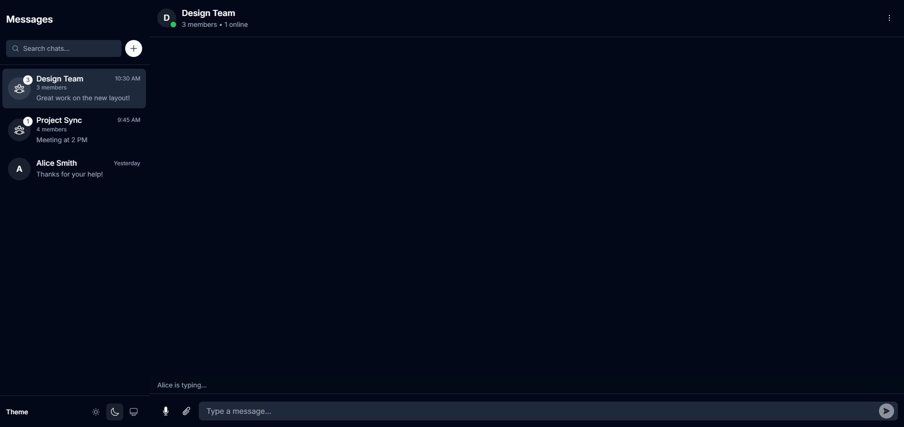

# ChatSync - Modern Real-Time Chat Application

ChatSync is a modern, feature-rich chat application built with Next.js 13, TypeScript, and Tailwind CSS. It offers a clean, minimalist design while providing powerful communication features for both individual and group conversations.



## ✨ Features

### Real-Time Messaging
- Instant message delivery
- Typing indicators
- Read receipts
- Message status updates
- Emoji reactions to messages

### Rich Media Support
- 🎤 Voice messages with real-time recording
- 📸 Image sharing with preview
- 📎 File attachments (PDF, DOC, etc.)
- 🖼️ Image gallery view
- ⬇️ One-click media downloads

### Group Chat Features
- Create and manage group conversations
- Member status indicators (online/offline)
- Member count and activity tracking
- Group-specific settings and preferences

### Modern UI/UX
- 🌓 Dark/Light theme support
- 📱 Responsive design (mobile & desktop)
- ⚡ Smooth animations and transitions
- 🎯 Minimalist, clean interface
- 🔍 Chat search functionality

### Technical Features
- Server-Side Rendering (SSR)
- Client-side state management
- Optimistic updates
- Lazy loading for media
- TypeScript type safety

## 🚀 Getting Started

### Prerequisites
- Node.js 16.8 or later
- npm or yarn package manager

### Installation

1. Clone the repository:
```bash
git clone https://github.com/yourusername/chatsync.git
cd chatsync
```

2. Install dependencies:
```bash
npm install
# or
yarn install
```

3. Create a `.env.local` file in the root directory and add your environment variables:
```env
NEXT_PUBLIC_API_URL=your_api_url
NEXT_PUBLIC_SOCKET_URL=your_socket_url
```

4. Run the development server:
```bash
npm run dev
# or
yarn dev
```

5. Open [http://localhost:3000](http://localhost:3000) in your browser.

## 🛠️ Tech Stack

- **Framework:** Next.js 13
- **Language:** TypeScript
- **Styling:** Tailwind CSS
- **Animation:** Framer Motion
- **Icons:** Heroicons
- **State Management:** React Hooks
- **Media Handling:** Browser APIs (MediaRecorder, File API)

## 📁 Project Structure

```
src/
├── app/                # Next.js 13 app directory
├── components/         # React components
│   ├── chat-area.tsx  # Main chat interface
│   ├── sidebar.tsx    # Chat list and navigation
│   ├── providers.tsx  # Theme and other providers
│   └── ...           # Other components
├── lib/               # Utility functions
├── styles/           # Global styles
└── types/            # TypeScript types
```

## 🔧 Configuration

### Theme Configuration
The application supports both light and dark themes. Theme configuration can be modified in `src/components/providers.tsx`.

### Message Types
Supported message types include:
- Text messages
- Voice messages
- Image attachments
- File attachments

## 📱 Mobile Support

ChatSync is fully responsive and optimized for mobile devices:
- Swipe gestures for navigation
- Mobile-optimized media capture
- Touch-friendly interface
- Adaptive layouts

## 🤝 Contributing

1. Fork the repository
2. Create your feature branch (`git checkout -b feature/AmazingFeature`)
3. Commit your changes (`git commit -m 'Add some AmazingFeature'`)
4. Push to the branch (`git push origin feature/AmazingFeature`)
5. Open a Pull Request

## 📄 License

This project is licensed under the MIT License - see the [LICENSE](LICENSE) file for details.

## 🙏 Acknowledgments

- [Next.js](https://nextjs.org/)
- [Tailwind CSS](https://tailwindcss.com/)
- [Framer Motion](https://www.framer.com/motion/)
- [Heroicons](https://heroicons.com/)

---

Made with ❤️ by Sandipan 
